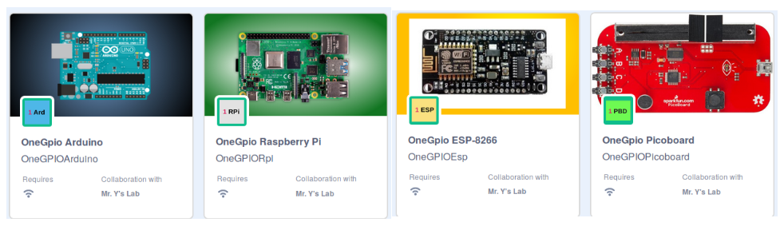

# Scratch 3 OneGPIO Extension Servers

## Control your favorite physical computing device using Scratch 3.

## Windows, Mac *AND* Linux(including Raspberry Pi) Compatible

## Quick Intallation Intructions:

* For Arduino, Circuit Playground Express, ESP-8266, ESP-32, Robohat-MM1, and Raspberry Pi
Pico boards, install the server firmware. See the 
  [Preparing Your Micro-Controller](https://mryslab.github.io/s3-extend/) section
  of the User's Guide.
  
* Launch the Scratch3 Editor using either the online or offline sites described
in the [Ready, Set, Go/Launch The Scratch3 Editor](https://mryslab.github.io/s3-extend/) 
  section of the User's Guide.
  
* Select your extension and start coding!.

## For full installation and usage, read the [Installation and User's Guide.](https://mryslab.github.io/s3-extend/)

This project was developed with
[Pycharm](https://www.jetbrains.com/pycharm/?from=s3-extend)

