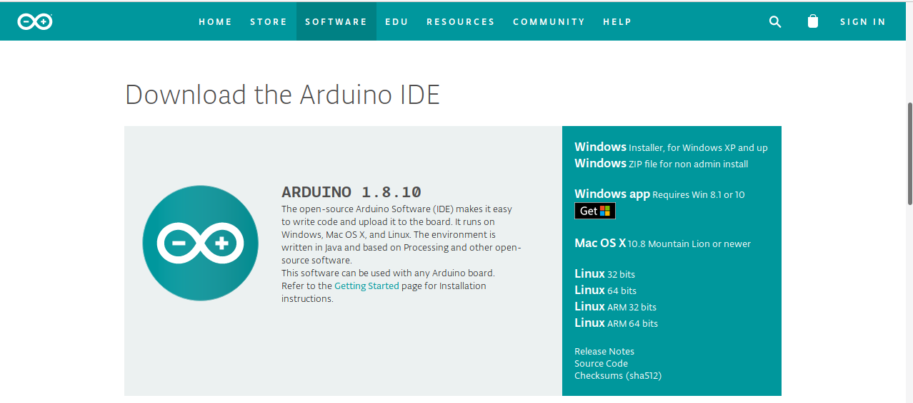
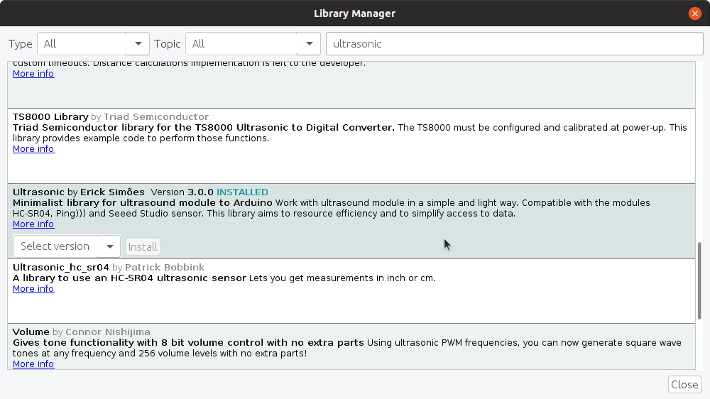

# FirmataExpress Installation Instructions

When s3-extend is installed using pip,  packages called
[pymata-express](https://mryslab.github.io/pymata-express/) and
[pymata_rh](https://github.com/MrYsLab/pymata_rh) 
are automatically installed to support Arduino boards and the RoboHAT MM1, 
respectively.
These packages are used to control
and monitor the two devices.

Both pymata-express and pymata_rh require a specialized
[Firmata ](https://github.com/firmata/protocol)sketch, called
[FirmataExpress,](https://github.com/MrYsLab/FirmataExpress) to be
installed on your Arduino or RoboHAT MM1.

The following steps explain how to install FirmataExpress on your
Arduino.

## Step 1: Arduino IDE Installation

If you have not already installed the Arduino IDE on your computer, go
to the [Arduino download page](https://www.arduino.cc/en/Main/Software)
and select a distribution for your operating system.
   
 
 
## Step 2: Install FirmataPlus Into The IDE

After installation, open the Arduino IDE and select Tools/Manage
Libraries. When the Libary Manager appears, enter *FirmataExpress* in
the search box, and click install.
 
   
 
 

## Step 3: Install The Ultrasonic Library Into The IDE
FirmataExpress also requires that the
[ultrasonic library](https://github.com/ErickSimoes/Ultrasonic) by Erick
Simões for operation. Once again, using the Arduino Library Manager and
search for ultrasonic and find the version by Erick Simoes. Click on the
Tools/Manage Libraries and select Ultrasonic and then click Install.**

## Step 4: Go Into The Tools Menus and Verify The Board Type and Port

## Step 5: Compile And Upload FirmataPlus Into The Arduino

Select File/Examples and from the drop-down list, select FirmataExpress.

  

Click on the upload button to compile and upload FirmataExpress to the
Arduino.  
  

## The Arduino is now ready for use.

     

Copyright (C) 2019-2021 Alan Yorinks All Rights Reserved
