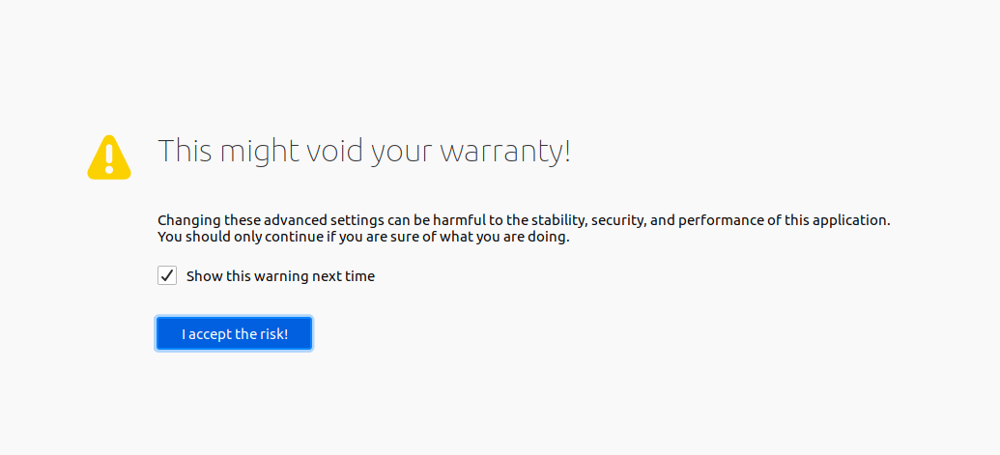
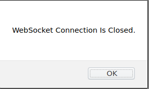

## Supported and Recommended Browsers

The recommended browser for the Scratch3 OneGPIO extensions is **Google Chrome**.

Firefox is also supported, but you may need to change a setting, as described in
the next section.

These are the only browsers supported at this time.

### If You Wish To Use Firefox
You may use Firefox, but you will need to configure it to do so.

The OneGPIO extensions use a WebSocket connection between the browser
and the WebSocket Gateway that is part of each extension server.

By default, Firefox does not allow connections to a WebSocket server. To
enable Firefox to allow WebSocket connections, open the following URL

``` 
about:config
```

You should see a warning screen similar to that below.

  </br>

Click on the *I accept the risk!* button.

Scroll down until you find the
*network.websocket.allowInsecureFromHTTPS* entry and double click false
to change its state to true.

Close Firefox and reopen. Scratch 3 OneGPIO should now function
properly.

## Trouble Shooting

### WebSocket Closed Warning

  </br>

If this warning pops up, make sure that you have
successfully started the Python code, as described in the
_How To Use The OneGPIO Extensions_ section of this document and that it is
still running.

If the warning appears after successfully starting the Python extension, then
please visit the Troubleshooting section for the extension you are using,
and follow the instructions there.

### Reporting Errors

If, after loading an extension, it is not behaving as expected, with the browser open, press the F12
 key on your keyboard to expose the
browser console. If you see any errors reported, and are still not sure
how to solve the issue,
[create an issue against the s3-extend distribution](https://github.com/MrYsLab/s3-extend/issues)
pasting any error output into the issue comment.

<br> <br> <br>


Copyright (C) 2019-2020 Alan Yorinks All Rights Reserved
