# The Circuit Playground Express Blocks

The blocks consist of a set of **HAT** blocks with a bump at the left top,
**boolean** blocks that have pointed ends, **reporter** blocks that are rounded in shape,
and **command** blocks that are rectangular in shape.

## HAT Blocks

HAT blocks test for a specific condition. When that condition is met for
the first time, all of the blocks under the HAT block execute.

### When BUTTON Switch Is Pressed/Released
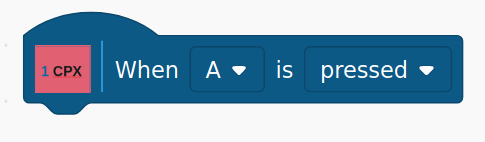

This block allows you to be notified when either button switch A or B, and the button is
either pressed or released.

### When SLIDE Switch Is Moved Left/Right
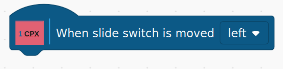

This block executes when the slide switch moves to the selected position.

### When CPX Position Is TILT_POSITION
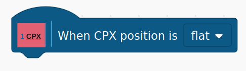

This block executes when the Playground Express tilt position changes to
Flat, Up, Down, Left, or Right.

### When A Loud Sound Is Detected
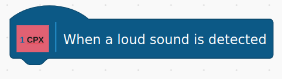

This block executes when a relatively loud sound is detected. The sound
only needs to be momentary, such as a hand clap.

### When A Touchpad Is Touched/Released
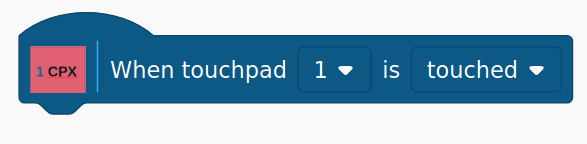

This block executes when the selected touchpad is either touched
or released.
 
 

## Boolean Blocks

Boolean blocks test for a specific condition and return either True or False.

### BUTTON Switch Is Pressed/Released
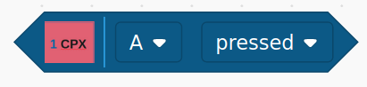

This block returns TRUE if the selected switch is currently in the selected
state. Otherwise, it returns FALSE.

### Light/Temperature Sensor Value is > or < Specified Value

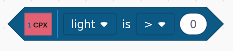

This block compares the current value of the selected sensor,
using the selected operator, to the value entered by the user.

### Tilt Position of The CPX

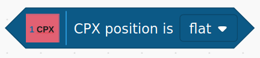

This block returns TRUE if the CPX is currently in the selected
tilt position.

### Selected Touchpad is Currently Touched/Released

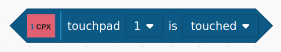

This block returns TRUE if the selected touchpad is currently in the
selected state.

## Reporter Blocks

Reporter blocks retrieve the current value for a selected sensor.

### Current Light/Temperature Value

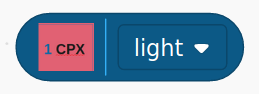

This block returns the current value for the selected sensor.
The light value is non-calibrated, and the temperature is expressed
in degrees Celsius.

## Command Blocks

Command blocks control actuators on the CPX.

### Set Neopixel To Color

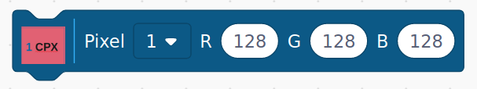

This block sets the selected neopixel to the red, green, and blue values
entered. To turn a neopixel off, set its r, g, and b values to zero.

### Play A Tone

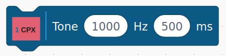

This block plays a tone at the specified frequency in Hertz for the duration
specified in milliseconds.

### Board LED On/Off

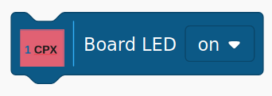

This block controls the state of the red board LED.

