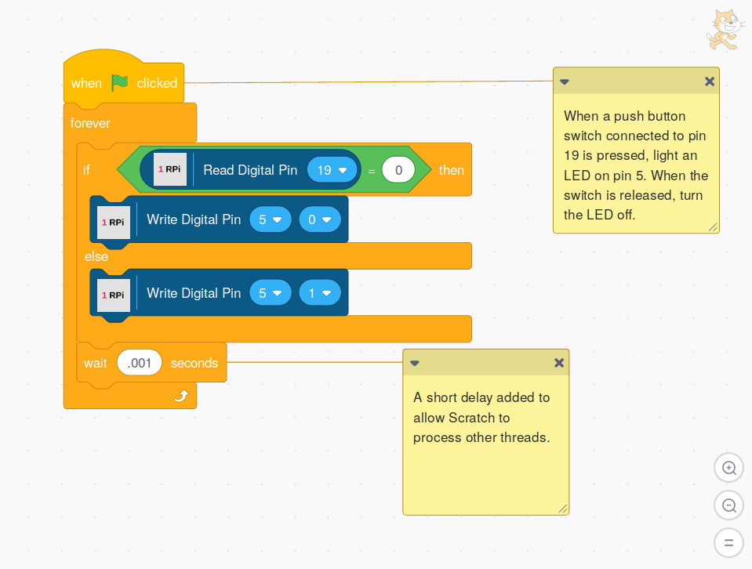

## Adding A Short Delay To Loops

It is often advisable to add a short delay within a loop to allow other
Scratch threads to run without blocking them.

     

Copyright (C) 2019-2023 Alan Yorinks All Rights Reserved
