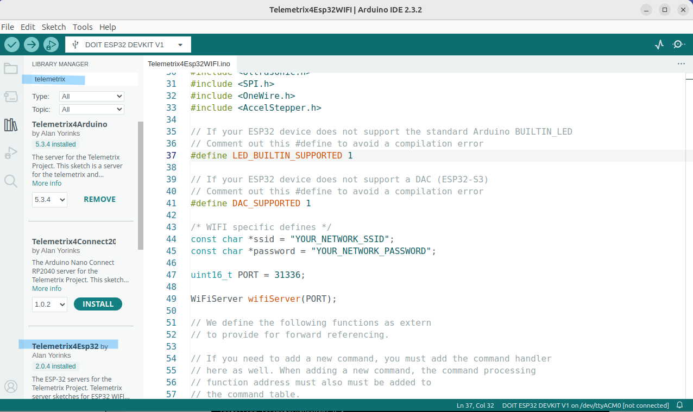
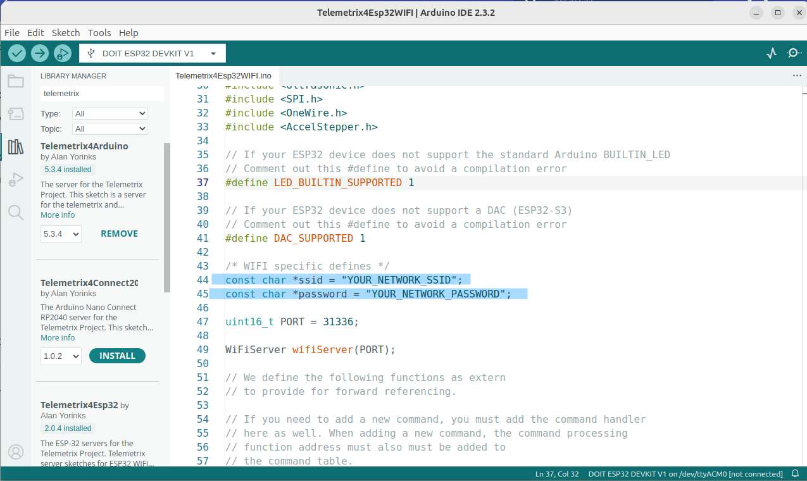
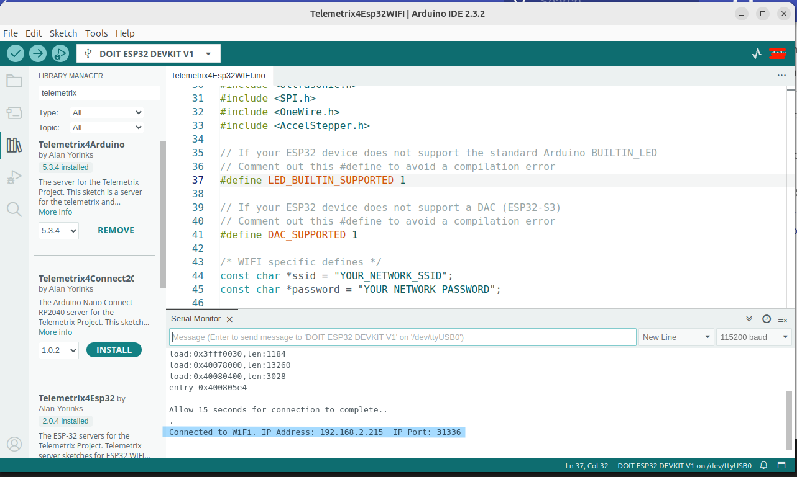

# ESP-32 NodeMCU Installation Instructions

The Arduino IDE is used to install the required software onto the 
ESP-32. 

## Installing The Arduino IDE
If you need to install the Arduino IDE on your computer, go to 
the [Arduino Download page](https://www.arduino.cc/en/software)
and download and install the IDE for your computer.

## Configuring The Boards Manager
The Arduino IDE boards manager must be configured to use the
ESP-32 Arduino Core.
The procedure is found 
[on this page.](https://docs.espressif.com/projects/arduino-esp32/en/latest/installing.html)

## Install The Telemetrix4ESP32 Sketch
To install the Telemetrix4Esp32 sketch, from the
Arduino IDE main menu, open **_Tools/Manage Libraries..._**

The following screenshot is from version 2 of the Arduino IDE:

  

In the search edit box, enter _**Telemetrix**_.

Select Telemetrix4Esp32 and press the **_Install_** button.

After the installation is complete, from the Arduino main menu, 
select File/Examples/Telemetrix4Esp32/Telemetrix4Esp32WIFI. 
The sketch's source code will appear in the Editor window.

## Configure Your Network Values In the Sketch
The sketch must be modified to contain your network SSID and password.

  

Replace "YOUR_NETWORK_SSID" and "YOUR_NETWORK_PASSWORD" with the values for your network.
Make sure that double quotes are still in place for both values.

Save the sketch.

## Upload The Sketch To the ESP-32
To upload the sketch to the NodeMCU, plug a USB cable into the 
NodeMCU and your computer, and from the Arduino IDE main menu Tools selection, 
choose Board/esp32, and from that menu, select the board you are using.
In my case, I am using a DoIt NodeMCU 1.0. Next, select the Com port from the
Tools/Port menu of the Arduino IDE.

Now, click on the Upload arrow (the horizontal arrow) below the Arduino IDE Main menu.
The sketch will take several seconds to compile and load.

## Determine The IP Address Assigned To The ESP-32
To determine the IP address assigned to the NodeMCU, open the Arduino IDE 
Serial Monitor (the button in the upper right of the Arduino IDE), set the speed to 
115200, and press the reset button on the NodeMCU. Within 15 seconds, 
you should see a message telling you the NodeMCU's IP address. 
Write this value down since you will need it later when using the Scratch3 Editor.

  

**NOTE:** When you reset the NodeMCU, the onboard LED will stay lit until
a connection is made with your router. You must wait for the LED to extinguish
before starting the s32 script.
 

