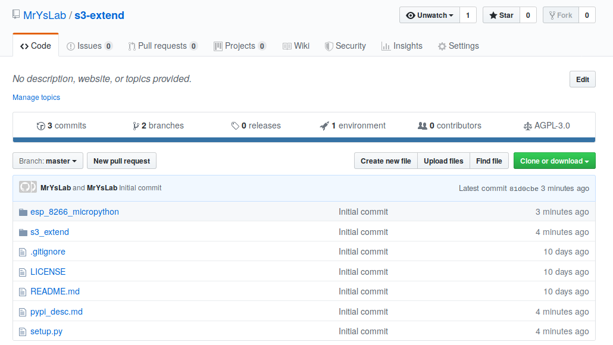

# ESP-8266 NodeMCU Installation Instructions

## 1. Install MicroPython On The ESP-8266

Full instructions for loading MicroPython can be found
[here](https://docs.micropython.org/en/latest/esp8266/tutorial/intro.html)
here.

In the
[Deploying The Firmware section](https://docs.micropython.org/en/latest/esp8266/tutorial/intro.html#deploying-the-firmware)
of the document, notice that there two commands to install the firmware.
The latter one contains a DIO option. This is the option I chose to gain access to the
REPL prompt.

## 2. Verify The REPL Prompt

Follow
[these instructions](https://docs.micropython.org/en/latest/esp8266/tutorial/repl.html#getting-a-micropython-repl-prompt)
to make sure that the installation was a success.
 
## 3. Setup WiFi Networking

Follow the procedure as described
[here.](https://docs.micropython.org/en/latest/esp8266/tutorial/network_basics.html#network-basics)
Once you have configured the device for WiFi, it will automatically
connect to your router.
 
## 4. Installing The *ampy* Tool

We need to install some files on to the ESP-8266 to communicate with the
Scratch extension. We will be using the *ampy* tool for file
manipulation on the ESP-8266. To install ampy, follow the instructions
[at this link.](https://learn.adafruit.com/micropython-basics-load-files-and-run-code/install-ampy)
There is a warning about not using the examples provided with the ampy 
tutorial. You can safely ignore 
the warning notice since we only need to install the tool. 

## 5. Getting The MicroPython Files To Install On To The ESP-8266

The files we need to install are
[main.py](https://github.com/MrYsLab/s3-extend/blob/master/esp_8266_micropython/main.py)
and
[esp_8266_min.py.](https://github.com/MrYsLab/s3-extend/blob/master/esp_8266_micropython/esp_8266_min.py)
The esp_8266_min.py file is a file with all unnecessary white space
removed. Here is a
[fully white-spaced enabled](https://github.com/MrYsLab/s3-extend/blob/master/esp_8266_micropython/esp_8266_max.py)
version of the source code.

The file needed to be "minified" so that it would fit on the 
ESP-8266 NodeMCU.

To get the files, go to the
[s3-extend web page, ](https://github.com/MrYsLab/s3-extend) and click
on the green ***Clone or download*** button in the upper right of the page.

  </br>


A .zip file is downloaded to your computer.

Unzip the file, and a directory called s3-extend-master is created and
populated with the files we need.

Here is the directory tree for s3-extend-master:

```
s3-extend-master
├── esp_8266_micropython
│   ├── esp_8266_max.py
│   ├── esp_8266_min.py
│   ├── __init__.py
│   └── main.py
├── LICENSE
├── pypi_desc.md
├── README.md
├── s3_extend
│   ├── gateways
│   │   ├── arduino_gateway.py
│   │   ├── esp8266_gateway.py
│   │   ├── __init__.py
│   │   ├── rpi_gateway.py
│   │   ├── servo.py
│   │   ├── sonar.py
│   │   ├── stepper.py
│   │   └── ws_gateway.py
│   ├── __init__.py
│   ├── s3a.py
│   ├── s3e.py
│   └── s3r.py
└── setup.py

```
Both files are located in the ***esp_8266_micropython*** directory.

## 6. Using *ampy* To Install The Files
Open a terminal window, and go into the ***esp_8266_micropython***
directory. 

To upload main.py to the ESP-8266, type in the following command:

```
ampy --port /dev/ttyUSB0 put main.py
```

**NOTE: ** You may need to change the port to match your system. Instead
of /dev/ttyUSB0, you may need to use something like COM5. Use the same
com port you used when testing the REPL.

Now upload esp_8266_min.py:
```
ampy --port /dev/ttyUSB0 put esp_8266_min.py
```

## 7. Powering Up
When you power up the board, you should see the red LED on the ESP-8266
NodeMCU flash a few times and then stay on. The LED will be extinguished
when the Scratch 3 extension successfully connects to the board. See the
*Ready, Set, Go* section of this document.
 
 <br> <br> <br>


Copyright (C) 2019-2020 Alan Yorinks All Rights Reserved
