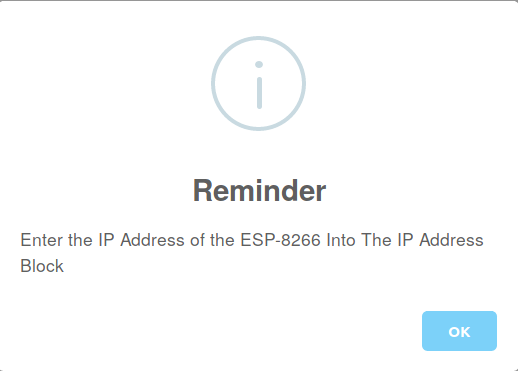

## The ESP-8266 Blocks

The blocks consist of a set of command blocks that are rectangular in
shape and reporter blocks rounded in shape.

NOTE: If you select the ESP-8266 OneGPIO, a Warning Dialog will pop up,
reminding you to enter and use the ESP-8266 IP address block. 

### Command Blocks

#### ESP-8266 IP Address
You must enter the WiFi IP address of the ESP-8266 into this block. This
block must precede any of the other ESP-8266 blocks, and should only be
used once.

#### Write Digital
This block allows you to select a pin and set its output to either a one
or zero. It has two parameters. The first is a drop-down list of valid
PINs. The second parameter is the output value.
It also is a drop-down list and contains the values zero and one.

#### Write PWM
This block allows you to select a pin and set its PWM output to be a
value between 0 and 100%. It has two parameters. The first is a
drop-down list of valid PINs. The second parameter allows you to fill in
a PWM value. If you use a PWM value of less than zero, it will be set to
0 internally. If you set the value to greater than 100, it will be set
to 100.

#### Tone
If you connect a Piezo type buzzer to a pin, this block will generate a
tone on the pin for the frequency and duration specified. It contains
three parameters. The first is a drop-down list of valid PINs. The
second allows you to specify the frequency of the tone in Herz. The
third parameter specifies the tone duration in milliseconds. If a
value greater than 5000 is entered, the value will be set to 5000
internally, limiting the maximum playing time to 5 seconds.

#### Write Servo
This block allows you to control the angle of a servo motor. It contains
two parameters. The first is a
drop-down list of valid PINs. The second specifies
the angle in degrees. The value is limited to be between 0 and 180.

### Reporter Blocks

#### Read Digital
This block allows you to read the current state of a digital input pin.
It has one parameter, a drop-down list containing all the valid PINs. It
reports a value of zero or one.

#### Read Analog
This block allows you to read the current state of an analog input pin.
It has one parameter, a drop-down list containing all the valid Pins. It
reports a value between 0 and 100.

#### Read Sonar
This block allows you to connect an HC-SR04 type device. It has two
parameters, both containing a drop-down list of valid PINs. The
first parameter allows you to select a trigger pin and the second an
echo pin. It returns the measured distance in centimeters.

     

Copyright (C) 2019 Alan Yorinks All Rights Reserved
