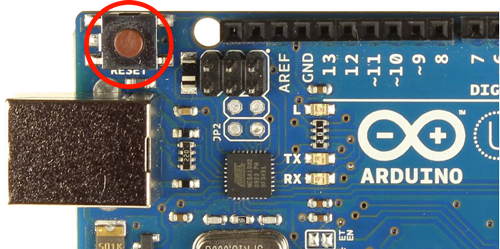
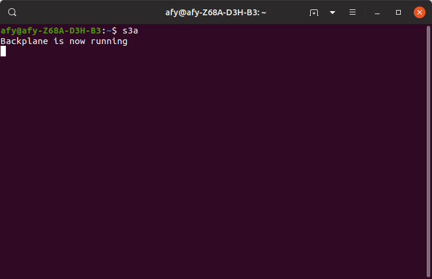
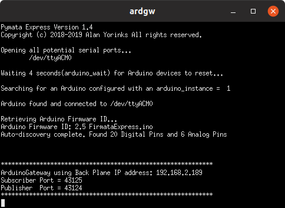
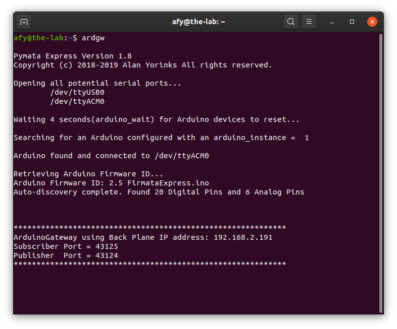
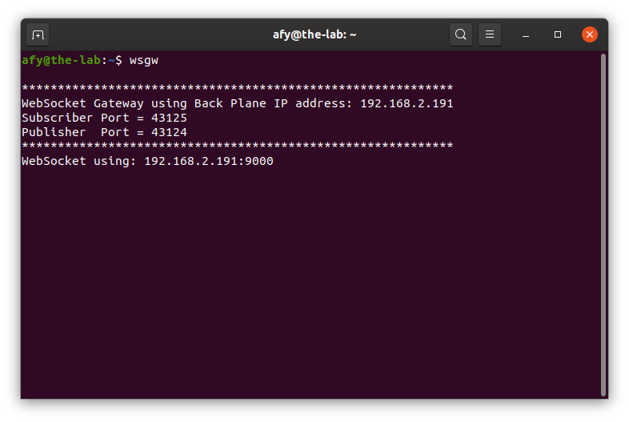

## Starting The OneGPIO Server For Arduino

With power applied to your Arduino, press and release the Arduino's reset button.


Next, open a terminal window and type:

```
s3a
```

<br>


This command automatically starts the Python Banyan Backplane and both
the Banyan WebSocket and Banyan Arduino Gateways. It starts an automatic 5-second
countdown timer to allow the Arduino adequate time to reset itself and start the 
Firmata-Express sketch.

To learn more about the Backplane and Gateways, visit "A Peek Under The Hood"
 for more information.


After the countdown time completes, the terminal window indicates that the Arduino
is initialized. You may now start Scratch 3 in your Web browser, as explained in the
"Launching Scratch 3" section of this document.

 


## Manually Specifying The COM Port

The Arduino Gateway will automatically discover the COM port that the Arduino Gateway
is using. 

If you wish to manually specify the COM port, use the **_-c_** command-line option
when starting s3a.

For example, if you are using Windows and the COM port you wish to use is COM6 then,
start s3a with the following command:

```
s3a -c COM6
```

For Linux or macOS, use the COM port designator specific to your operating system. 
For example, if the COM port is /dev/ttyACM0, then start s3a with the following command:

```
s3a -c /dev/ttyACM0
```

## Manually Specifying An Arduino Instance

If you have multiple Arduino's plugged into your computer, you can explicitly
tell s3a which one to use by taking advantage of the 
[pymata-express Arduino Instance Id Feature,](https://mryslab.github.io/pymata-express/firmata_express/)

You may do so using the **_-i_** command-line option:

```
s3a -i 2
```

## Troubleshooting

Only use a high-quality USB cable. Verify that you properly connected the cable to both your computer and the Arduino. 
If s3a detects an error in either the backplane or the two gateways, it will shut itself down. 

To troubleshoot why this may be happening, open a new terminal window and type:

```
backplane
```
You should see a similar output, as shown below, indicating that the
backplane is running correctly. The IP address does not need to match
the one shown.


Next, open an additional terminal window and type:

```
ardgw
```



You should see a window similar to the one shown above.

If you do not, make sure that you've flashed the Arduino with the
FirmataExpress sketch, as explained in the "Preparing Your
Micro-Controller" section of this document.

Also, make sure that you've plugged the Arduino into a USB port before
starting s3a.

Next, open a third terminal window and type:

```
wsgw
```



You should see a window similar to the one shown above.

If there are exceptions or errors in any of the terminal windows,
[create an issue against the s3-extend distribution](https://github.com/MrYsLab/s3-extend/issues)
pasting any error output into the issue comment.


<br> <br> <br>


Copyright (C) 2019-2023 Alan Yorinks All Rights Reserved
