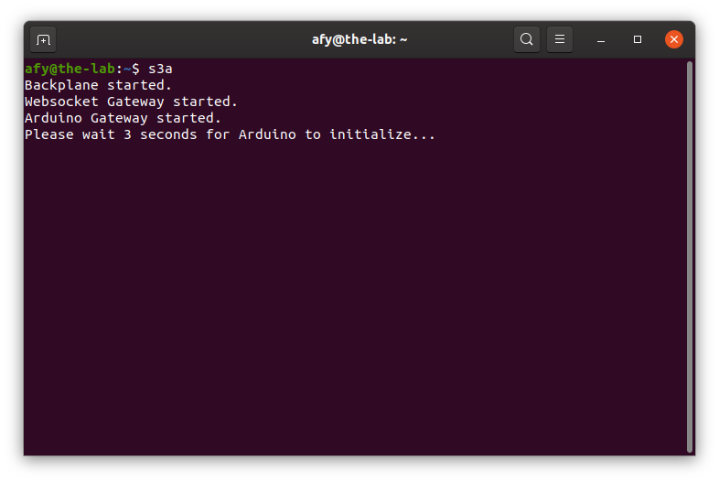

## Starting The OneGPIO Server For Arduino

With power applied to your Arduino, press the Arduino's reset button.


Next, open a terminal window and type:

```
s3a
```

<br>


This command automatically starts the Python Banyan Backplane, and both
the Banyan WebSocket and Banyan Arduino Gateways. The s3a command will
automatically open two other windows, one for the Arduino Gateway, and
the other for the Web Socket Gateway.

Visit "A Peek Under The Hood" for more information about the Backplane and Gateways.

 

The Arduino Gateway window displays a Banyan information header,
including the Arduino's com port. Note that it will take about four 
seconds for the Arduino Gateway to perform board discovery.


The WebSocket Gateway displays an informational banner with the
WebSocket IP address and port number in use.

You may now start Scratch 3 in your Web browser, as explained in the
"Launching Scratch 3" section of this document.

If you wish to specify a COM port manually, then start s3a with a 
-c command-line option:

```
s3a -c COM6
```

If you wish to use the
[pymata-express Arduino Instance Id Feature,](https://mryslab.github.io/pymata-express/firmata_express/)
you may do so using the -i command-line option:

```
s3a -i 2
```

If you wish to turn on logging, use the -l command-line option

```
s3a -l True
```

There are two possible logs that will be placed in your home directory,
ardgw.log and wsgw.log.

## Troubleshooting

Only use a high-quality USB cable. Make sure that the USB cable you are
using is fully plugged into your computer and the Arduino. If only one
or none of the Gateway windows stay open, dismiss s3a by pressing
Control-C and dismiss the terminal window.

Open a new terminal and type:

```
backplane
```
You should see a similar output, as shown below, indicating that the
backplane is running correctly. The IP address does not need to match
the one shown.


Next, open an additional terminal window and type:

```
ardgw
```
You should see a window similar to the one shown above for the Arduino
Gateway when the s3a command succeeds.

If you do not, make sure that you've flashed the Arduino with the
FirmataExpress sketch, as explained in the "Preparing Your
Micro-Controller" section of this document.

Also, make sure that you've plugged the Arduino into a USB port before
starting s3a.

Next, open a third terminal window and type:

```
wsgw
```
You should see a window similar to the one shown above for the WebSocket
Gateway when the s3a command succeeds. 

If there are exceptions or errors in any of the terminal windows,
[create an issue against the s3-extend distribution](https://github.com/MrYsLab/s3-extend/issues)
pasting any error output into the issue comment.


<br> <br> <br>


Copyright (C) 2019 Alan Yorinks All Rights Reserved
