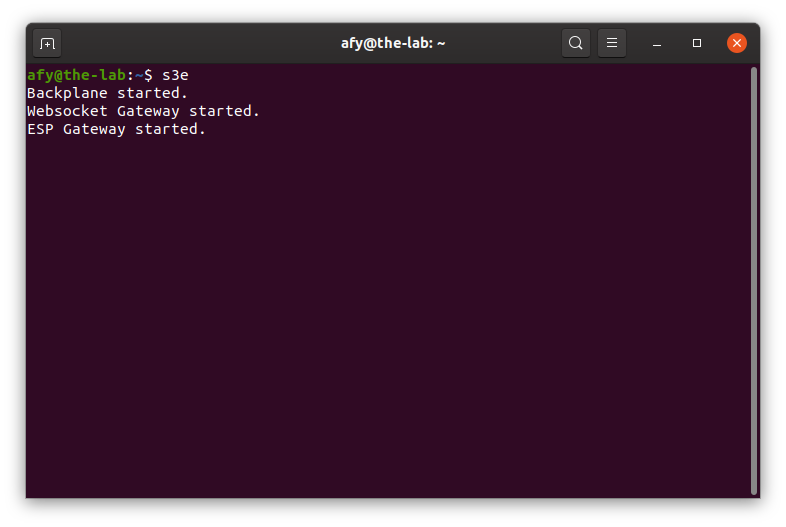
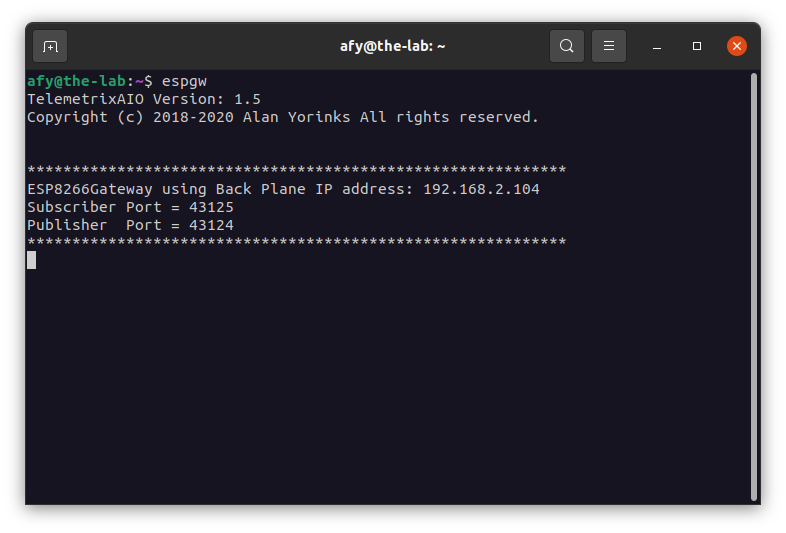

## Starting The OneGPIO Server For The ESP-8266

Apply power to the ESP-8266. The red LED should blink a few times and
then stay continually on. 

Next, open a terminal window and type:

```
s3e
```

<br>


This command automatically starts the Python Banyan Backplane, and both
the Banyan WebSocket and Banyan ESP-8266 Gateways. The s3e command will
automatically open two other windows, one for the ESP-8266 Gateway, and
the other for the Web Socket Gateway.

Visit "A Peek Under The Hood" for more information about the Backplane and Gateways.

 

The ESP-8266 Gateway window displays a Banyan information header


The WebSocket Gateway displays an informational banner with the
WebSocket IP address and port number in use.

You may now start Scratch 3 in your Web browser, as explained in the
"Launching Scratch 3" section of this document.

## Troubleshooting
If only one or none of the Gateway windows stay open, dismiss s3e by
pressing Control-C and dismiss the terminal window.

Open a new terminal and type:

```
backplane
```
You should see a similar output, as shown below, indicating that the
backplane is running correctly. The IP address does not need to match
the one shown.


Next, open an additional terminal window and type:

```
espgw
```
You should see a window similar to the one shown above for the ESP-8266
Gateway when the s3e command succeeds.

If you do not, make sure that you've installed MicroPython on the
ESP-8266 and flashed it with main.py and esp8266_min.py as explained in
the "Preparing Your Micro-Controller" section of this document.

Next, open a third terminal window and type:

```
wsgw
```
You should see a window similar to the one shown above for the WebSocket
Gateway when the s3e command succeeds. 

If there are exceptions or errors in any of the terminal windows,
[create an issue against the s3-extend distribution](https://github.com/MrYsLab/s3-extend/issues)
pasting any error output into the issue comment.


<br> <br> <br>


Copyright (C) 2019 Alan Yorinks All Rights Reserved

