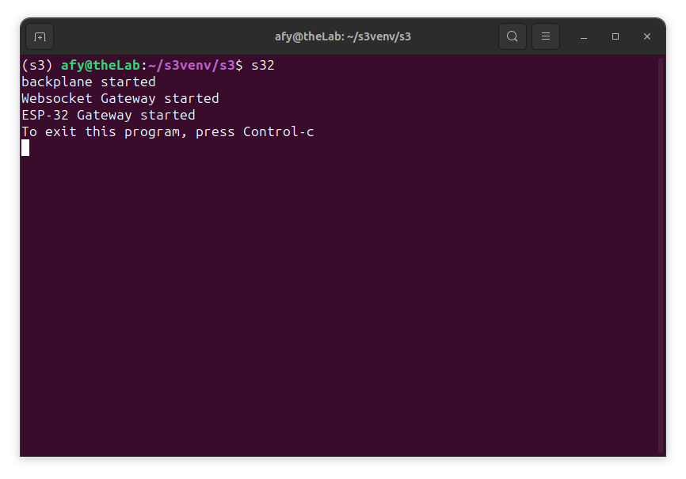
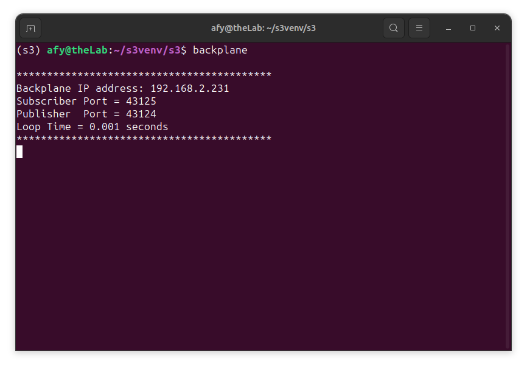
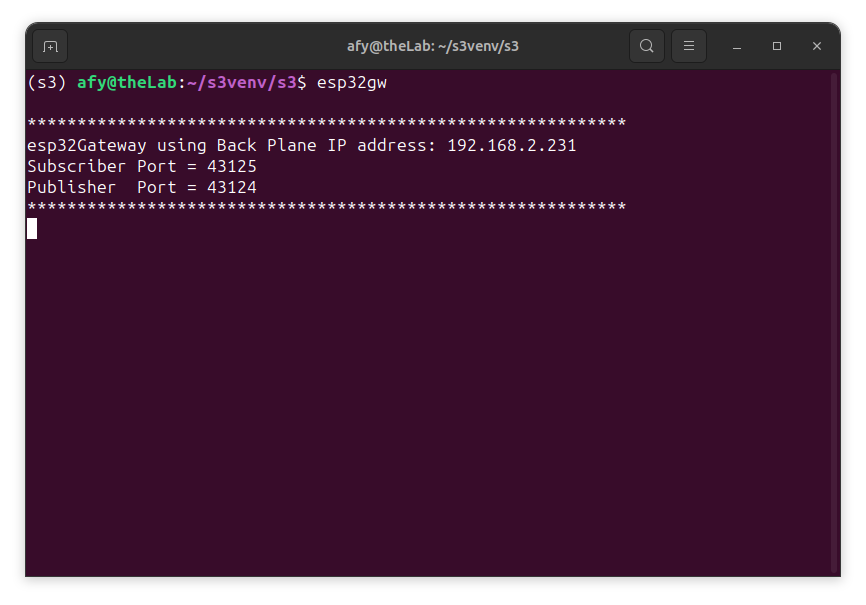
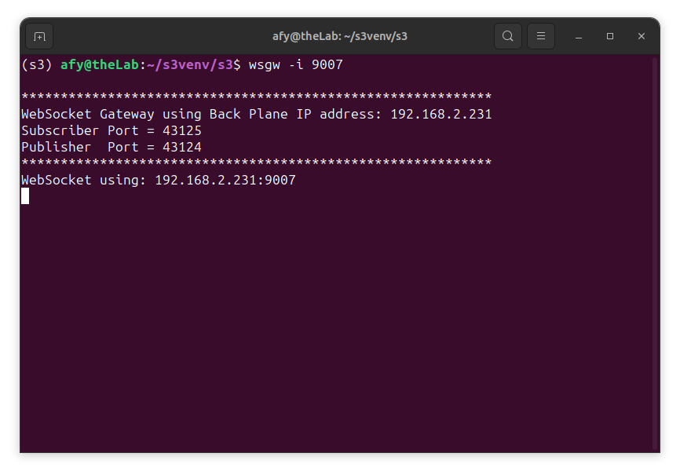

## Starting The OneGPIO Server For The ESP-32


Apply power to the ESP-32.

**Note:** For the following discussion, s3-extend was installed in a virtual 
environment,
and the screenshots below 
reflect this.

Next, open a terminal window and type:

```
s32
```

<br>


This command automatically starts the Python Banyan Backplane, 
the Banyan WebSocket Gateway, and the Banyan ESP-32 Gateway. 

You may now start Scratch 3 in your Web browser, as explained in this 
document's "Launching Scratch 3" section.

## Troubleshooting
If the command window does not look similar to the one above, 
open a new terminal and type:


```
backplane
```
A similar output, as shown below, indicates that the backplane is running correctly. 
The IP address does not need to match the one shown. The IP address does not need to match
the one shown.



Next, open an additional terminal window and type:

```
espgw
```



You should see a window similar to the one shown above for the ESP-32
Gateway when the s3e command succeeds.

Next, open a third terminal window and type:

```
wsgw -i 9007
```



You should see a window similar to the one shown above for the WebSocket
Gateway when the _wsgw_ command succeeds. 

If there are exceptions or errors in any terminal window,
[create an issue against the s3-extend distribution,](https://github.com/MrYsLab/s3-extend/issues)
pasting any error output into the issue comment.


