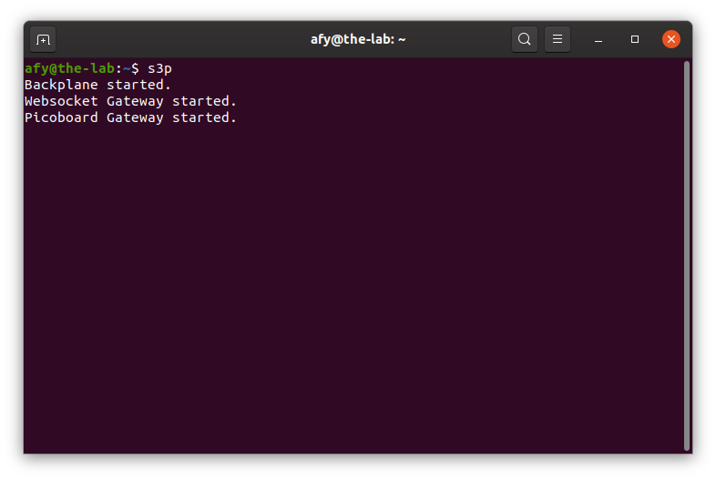
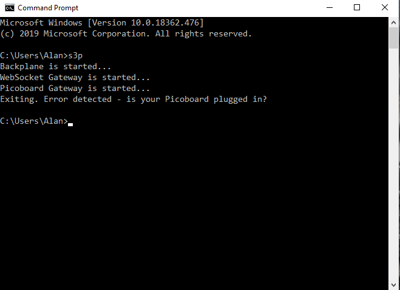

## Starting The OneGPIO Server For The Picoboard

Plug the Picoboard into a USB connector on your computer

Next, open a terminal window and type:

```
s3p
```
<br>


This command automatically starts the Python Banyan Backplane, and both
the Banyan WebSocket and Banyan ESP-8266 Gateways.

If you remove the USB cable after starting s3p, or if you have forgotten
to plug in the cable before starting s3p, you will see the following:

<br>


Visit "A Peek Under The Hood" for more information about the Backplane and Gateways.


<br> <br> <br>


Copyright (C) 2019 Alan Yorinks All Rights Reserved
