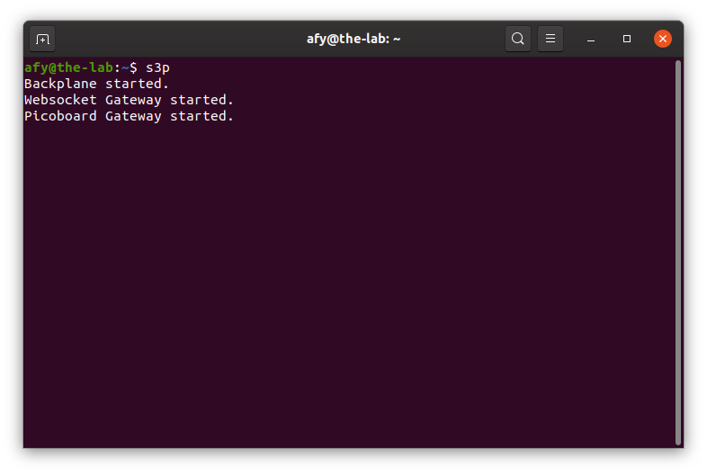
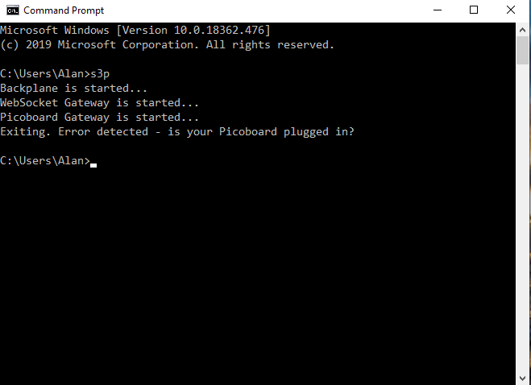
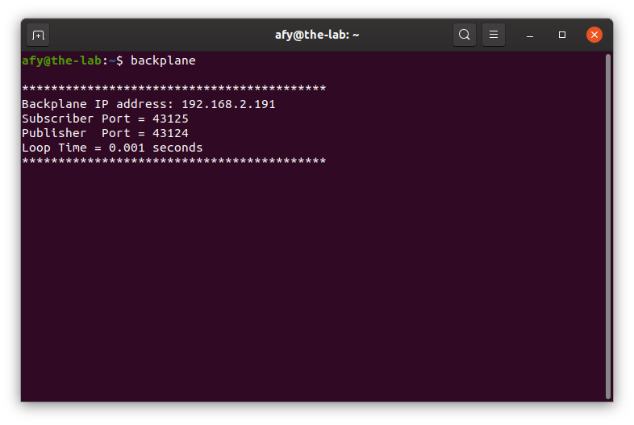
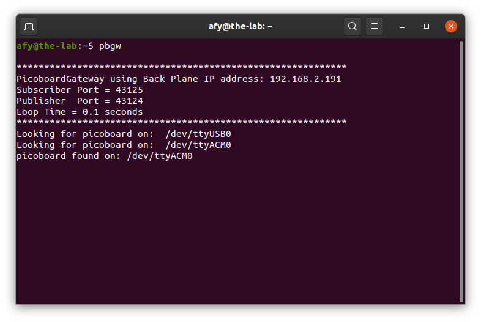
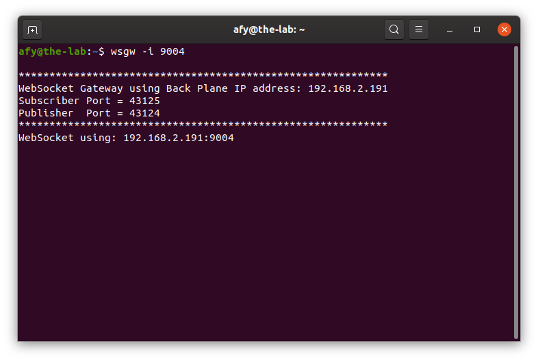

## Starting The OneGPIO Server For The Picoboard

Plug the Picoboard into a USB connector on your computer

Next, open a terminal window and type:

```
s3p
```
<br>


This command automatically starts the Python Banyan Backplane and both
the Banyan WebSocket and Banyan Picoboard Gateways.

If you remove the USB cable after starting s3p, or if you have forgotten
to plug in the cable before starting s3p, you will see something similar to 
the following:

<br>


Here, s3p detected that the Picoboard Gateway was not running, and therefore
shut down all its processes.

Visit "A Peek Under The Hood" for more information about the Backplane and Gateways.


## Troubleshooting

Only use a high-quality USB cable. Verify that you properly connected the cable to both your computer and the Picoboard. 
If s3p detects an error in either the backplane or either of the two gateways, it will shut itself down. 

To troubleshoot why this may be happening, open a new terminal window and type:

```
backplane
```

You should see a similar output, as shown below, indicating that the
backplane is running correctly. The IP address does not need to match
the one shown.



Next, open an additional terminal window and type:

```
pbgw
```



You should see a window similar to the one shown above. Here, the screenshot indicates
that there are two active COM ports. The Picoboard Gateway checks all of the active
COM ports until it finds a connected Picoboard.

Next, open a third terminal window and type:

```bash
wsgw -i 9004
```



You should see a window similar to the one shown above.

If there are exceptions or errors in any of the terminal windows,
[create an issue against the s3-extend distribution](https://github.com/MrYsLab/s3-extend/issues)
pasting any error output into the issue comment.


