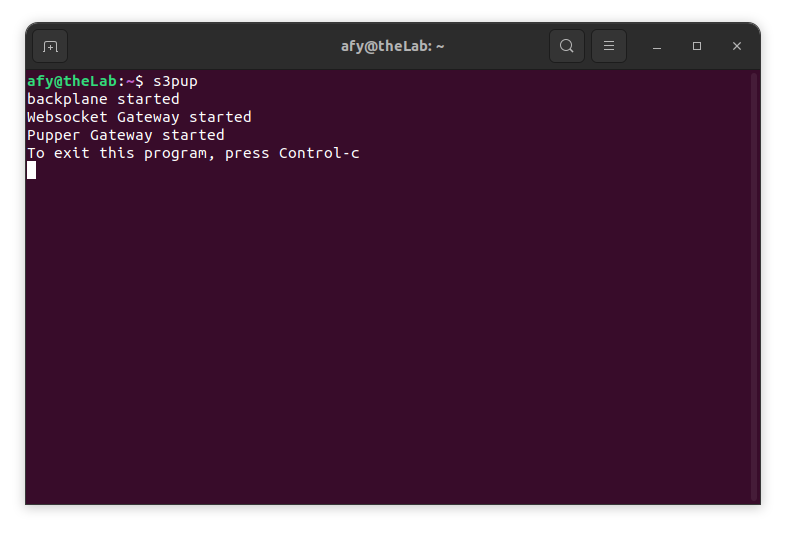
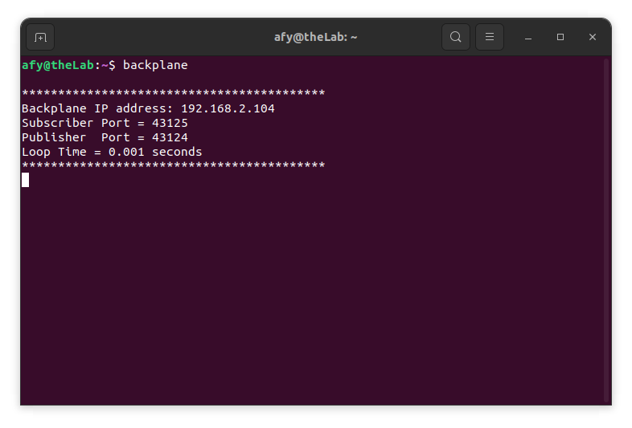
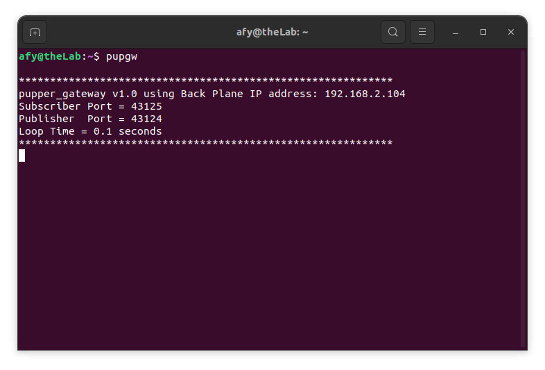
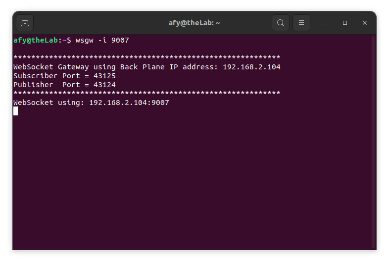

## Starting The OneGPIO Server For The Pupper Robot

Power up the Robot.

Next, open a terminal window and type:

```
s3pup
```
<br>


This command automatically starts the Python Banyan Backplane and both
the Banyan WebSocket and the Pupper Robot gateway.

Visit "A Peek Under The Hood" for more information about the Backplane and Gateways.


## Troubleshooting

If s3pup detects an error in either the backplane or either of the two gateways, it will 
shut itself down.

To troubleshoot why this may be happening, open a new terminal window and type:

```
backplane
```

You should see a similar output, as shown below, indicating that the
backplane is running correctly. The IP address does not need to match
the one shown.



Next, open an additional terminal window and type:

```
pupgw
```



You should see a window similar to the one shown above. Here, the screenshot displays
the version of the Pupper gateway.

Next, open a third terminal window and type:

```bash
wsgw -i 9007
```



You should see a window similar to the one shown above.

If there are exceptions or errors in any of the terminal windows,
[create an issue against the s3-extend distribution](https://github.com/MrYsLab/s3-extend/issues)
pasting any error output into the issue comment.


<br> <br> <br>


Copyright (C) 2019-2023 Alan Yorinks All Rights Reserved
