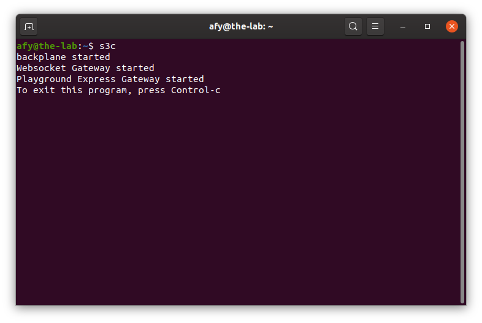
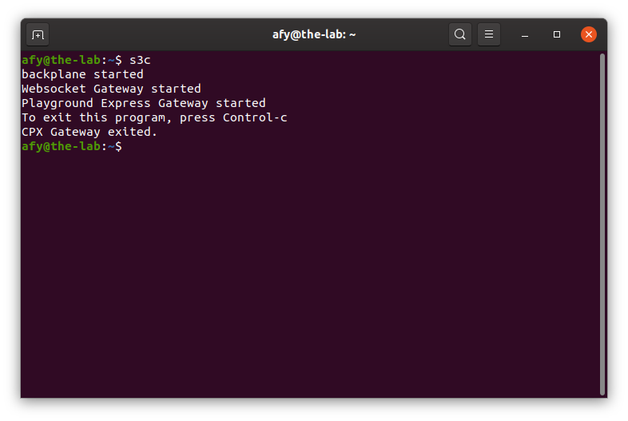
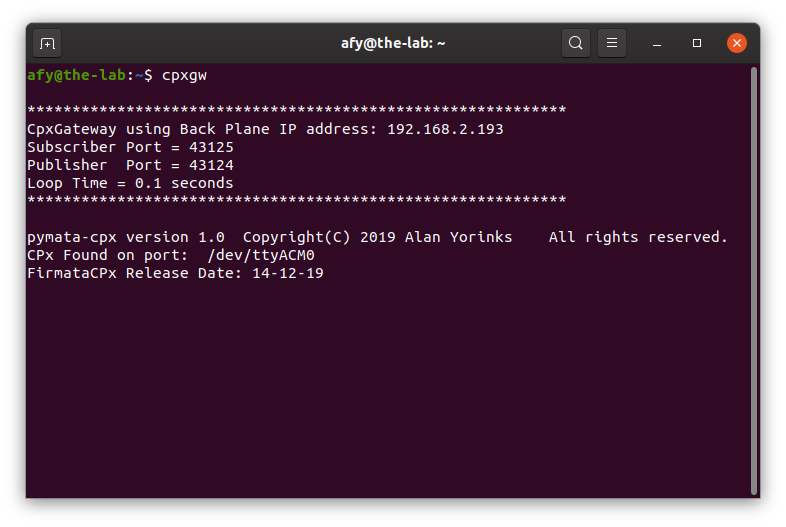
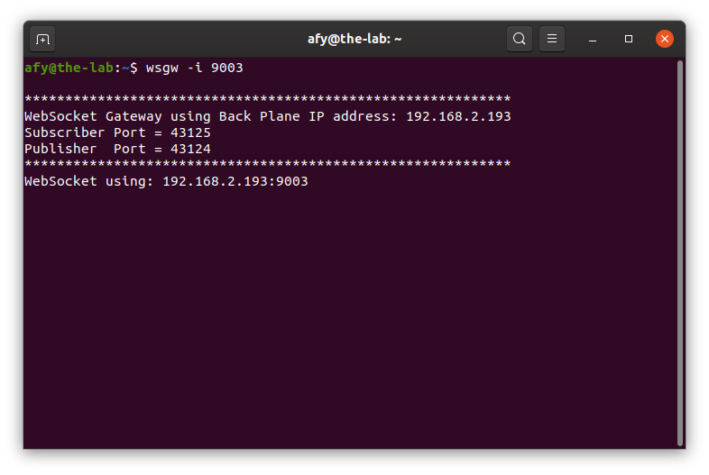

## Starting The OneGPIO Server For The Circuit Playground Express

Plug the Circuit Playground Express into a USB connector on your computer

Next, open a terminal window and type:

```
s3c
```
<br>


This command automatically starts the Python Banyan Backplane and both
the Banyan WebSocket and Banyan Circuit Playground Express Gateways.

If you remove the USB cable after starting s3c, or if you have forgotten
to plug in the cable before starting s3c, you will see something similar to
the following:

<br>


Here, s3c tried to start the Circuit Playground Express Gateway but detected an error
and aborted it.

Visit "A Peek Under The Hood" for more information about the Backplane and Gateways.


## Troubleshooting

Only use a high-quality USB cable. Verify that you properly
connected the cable to both your computer and the Circuit Playground express.
If s3c detects an error in either the backplane or either of the two gateways, it will shut itself down.

To troubleshoot why this may be happening, open a new terminal window and type:

```
backplane
```

You should see a similar output, as shown below, indicating that the
backplane is running correctly. The IP address does not need to match
the one shown.


Next, open an additional terminal window and type:

```
cpxgw
```



You should see a window similar to the one shown above. Here, the screenshot displays
the version of pymata-cpx and the release date of FirmataCPx.

Next, open a third terminal window and type:

```bash
wsgw -i 9003
```



You should see a window similar to the one shown above.

If there are exceptions or errors in any of the terminal windows,
[create an issue against the s3-extend distribution](https://github.com/MrYsLab/s3-extend/issues)
pasting any error output into the issue comment.


<br> <br> <br>


Copyright (C) 2019-2021 Alan Yorinks All Rights Reserved
