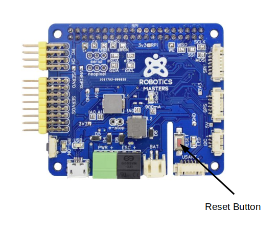
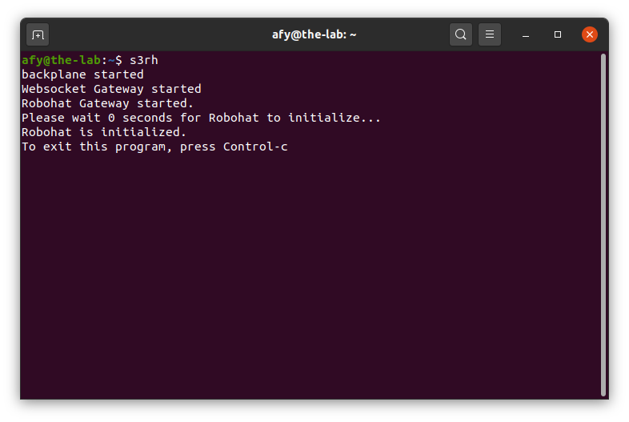

## Starting The OneGPIO Server For RoboHAT MM1

Power the  RoboHAT and then press and release the RoboHAT's reset button.


Next, open a terminal window and type:

```
s3rh
```

<br>


This command automatically starts the Python Banyan Backplane, and both
the Banyan WebSocket and Banyan RoboHAT Gateways. It starts an automatic 5-second
countdown timer to allow the RoboHAT adequate time to reset itself and start the 
Firmata-Express sketch.

To learn more about the Backplane and Gateways, visit "A Peek Under The Hood"
 for more information.


After the countdown time completes, the terminal window indicates that the RoboHAT
is initialized. You may now start Scratch 3 in your Web browser, as explained in the
"Launching Scratch 3" section of this document.

 


## Manually Specifying The COM Port

The RoboHAT Gateway will automatically discover the COM port that the RoboHAT Gateway
is using. 

If you wish to manually specify the COM port, use the **_-c_** command-line option
when starting s3rh.

For example, if you are using Windows and the COM port you wish to use is COM6,
start s3rh with the following command:

```
s3rh -c COM6
```

For Linux or macOS, use the COM port designator specific to your operating system. 
For example, if the COM port is /dev/ttyACM0 start s3rh with the following command:

```
s3rh -c /dev/ttyACM0
```

## Manually Specifying An RoboHAT Instance

If you are you using one or more Arduino's while using the RoboHAT, you can explicitly
tell s3rh which one to use by taking advantage of the 
[FirmataExpress Arduino Instance Id Feature,](https://mryslab.github.io/pymata_rh/firmata_express/)

You may do so using the **-i** command-line option:

```
s3rh -i 2
```

## Troubleshooting

Only use a high-quality USB cable. Verify that you correctly connected the cable to both your computer and the RoboHAT. 
If s3rh detects an error in either the backplane or the two gateways, it will shut itself down. 

To troubleshoot why this may be happening, open a new terminal window and type:

```
backplane
```
You should see a similar output, as shown below, indicating that the
backplane is running correctly. The IP address does not need to match
the one shown.


Next, open an additional terminal window and type:

```
rhgw
```


You should see a window similar to the one shown above.

If you do not, make sure that you've flashed the RoboHAT with the
FirmataExpress sketch, as explained in the "Preparing Your
Micro-Controller" section of this document.

Also, make sure that you've plugged the RoboHAT into a USB port before
starting s3rh.

Next, open a third terminal window and type:

```
wsgw -i 9005
```


You should see a window similar to the one shown above.

If there are exceptions or errors in any of the terminal windows,
[create an issue against the s3-extend distribution](https://github.com/MrYsLab/s3-extend/issues)
pasting any error output into the issue comment.


<br> <br> <br>


Copyright (C) 2019-2020 Alan Yorinks All Rights Reserved
