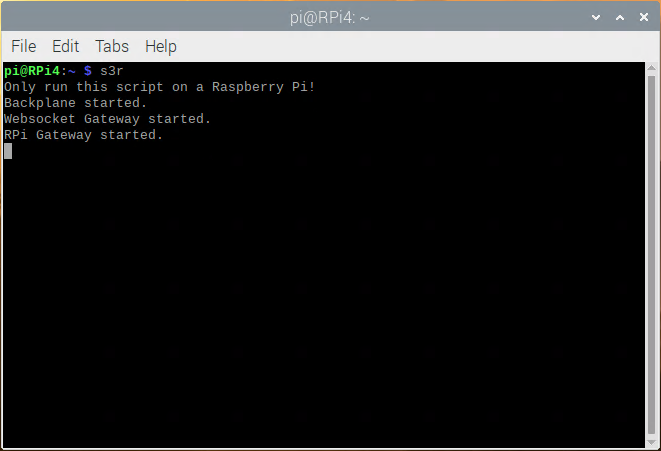
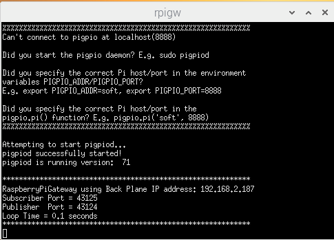
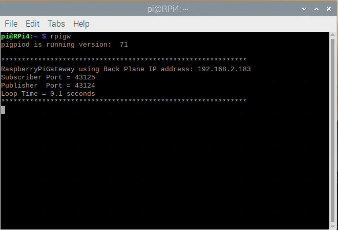
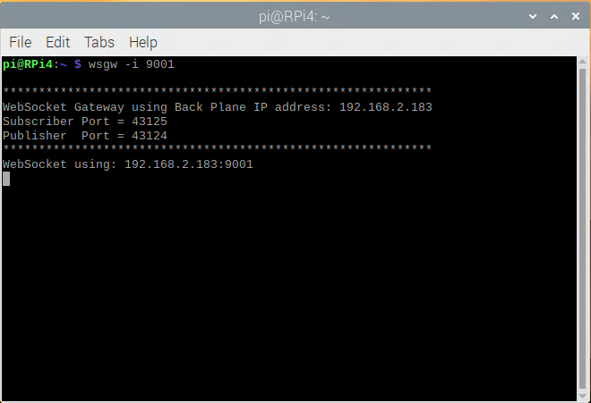

## Starting The OneGPIO Server For Raspberry Pi

Apply power to the Raspberry Pi. 

Next, after logging in, open a terminal window and type:

```
s3r
```

<br>



This command automatically starts the Python Banyan Backplane and both
the Banyan WebSocket and Banyan Raspberry Pi Gateways. 

**IMPORTANT NOTE:** The s3r command is intended to run exclusively on a
Raspberry Pi.

Visit "A Peek Under The Hood" for more information about the Backplane and Gateways.

You may now start Scratch 3 in your Web browser, as explained in the
"Launching Scratch 3" section of this document.

## Troubleshooting
If the command window does not look similar to the one above, 
open a new terminal and type:


```
backplane
```
You should see a similar output, as shown below, indicating that the
backplane is running correctly. The IP address does not need to match
the one shown.



Next, open an additional terminal window and type:

```
rpigw
```



You should see a window similar to the one shown above for the ESP-8266
Gateway when the s3e command succeeds.

If you do not, make sure that you've installed MicroPython on the
ESP-8266 and flashed it with main.py and esp8266_min.py as explained in
the "Preparing Your Micro-Controller" section of this document.

Next, open a third terminal window and type:

```
wsgw -i 9001
```



You should see a window similar to the one shown above for the WebSocket
Gateway when the s3e command succeeds. 

If there are exceptions or errors in any of the terminal windows,
[create an issue against the s3-extend distribution](https://github.com/MrYsLab/s3-extend/issues)
pasting any error output into the issue comment.


<br> <br> <br>


Copyright (C) 2019-2023 Alan Yorinks All Rights Reserved

