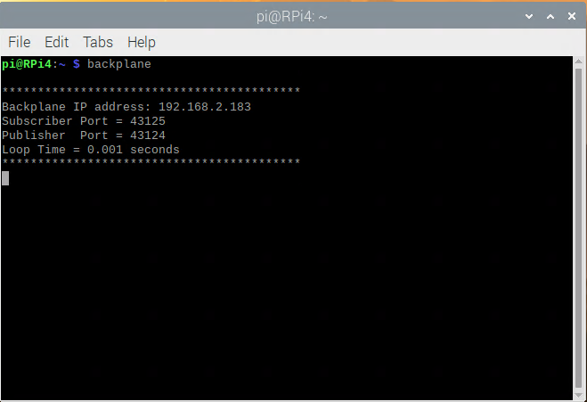

## Starting The OneGPIO Server For Raspberry Pi

Apply power to the Raspberry Pi. 

Next, open a terminal window and type:

```
s3r
```

<br>


This command automatically starts the Python Banyan Backplane, and both
the Banyan WebSocket and Banyan Raspberry Pi Gateways. The s3r command
will automatically open two other windows, one for the Raspberry Pi Gateway,
and the other for the Web Socket Gateway.

**IMPORTANT NOTE:** The s3r command is intended to run exclusively on a
Raspberry Pi.

Visit "A Peek Under The Hood" for more information about the Backplane and Gateways.

 

The Raspberry Pi Gateway window displays a Banyan information header and
the current version number for the pigpiod library.


The WebSocket Gateway displays an informational banner with the
WebSocket IP address and port number in use.

You may now start Scratch 3 in your Web browser, as explained in the
"Launching Scratch 3" section of this document.

## Troubleshooting
If only one or none of the Gateway windows stay open, dismiss s3e by
pressing Control-C and dismiss the terminal window.

Open a new terminal and type:

```
backplane
```
You should see a similar output, as shown below, indicating that the
backplane is running correctly. The IP address does not need to match
the one shown.


Next, open an additional terminal window and type:

```
rpigw
```
You should see a window similar to the one shown above for the Raspberry
Pi Gateway when the s3r command succeeds.

Next, open a third terminal window and type:

```
wsgw
```
You should see a window similar to the one shown above for the WebSocket
Gateway when the s3e command succeeds. 

If there are exceptions or errors in any of the terminal windows,
[create an issue against the s3-extend distribution](https://github.com/MrYsLab/s3-extend/issues)
pasting any error output into the issue comment.

<br> <br> <br>


Copyright (C) 2019 Alan Yorinks All Rights Reserved

