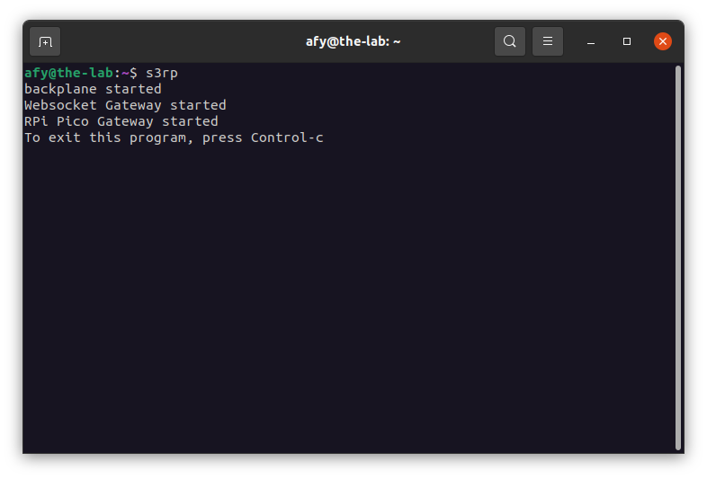
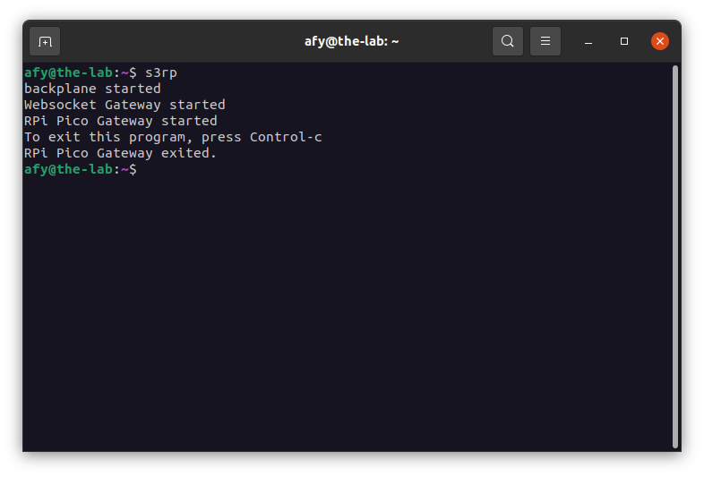
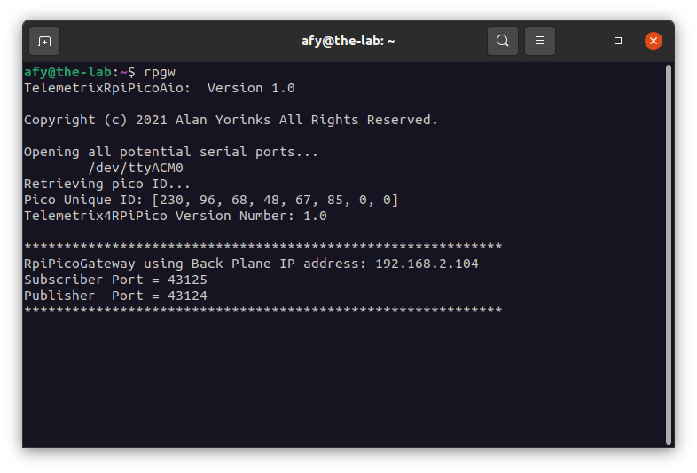
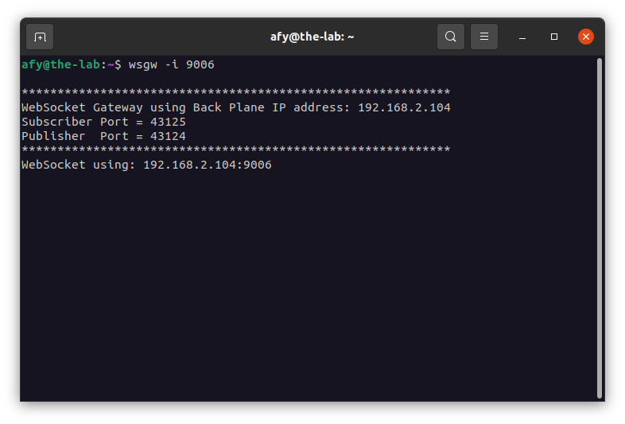

## Starting The OneGPIO Server For The Raspberry Pi Pico

Make sure that you have the 
[server application installed](https://mryslab.github.io/telemetrix-rpi-pico/install_pico_server/) 
on your
Pico.

Plug your USB cable to power up the board. You should see the green LED
flash twice. If not, check your cable and the connection.

Next, open a terminal window and type:

```
s3rp
```
<br>


This command automatically starts the Python Banyan Backplane and
the Banyan WebSocket, and Banyan Raspberry Pi Pico Gateways.

If you remove the USB cable after starting _s3rp_, or if you have forgotten
to plug in the cable before starting _s3rp_, you will see something similar to
the following:

<br>


Here, _s3rp_ tried to start the Raspberry Pi Pico Gateway but detected an error
and aborted.

Visit "A Peek Under The Hood" for more information about the Backplane and Gateways.


## Troubleshooting

Only use a high-quality USB cable. Verify that you properly
connected the cable to both your computer and the Raspberry Pi Pico.
If _s3rp_ detects an error in either the backplane or either of the two gateways, it will shut itself down.

To troubleshoot why this may be happening, open a new terminal window and type:

```
backplane
```

You should see a similar output, as shown below, indicating that the
backplane is running correctly. The IP address does not need to match
the one shown.


Next, open an additional terminal window and type:

```
rpgw
```



You should see a window similar to the one shown above. Here, the screenshot displays
the version of tmx-pico-aio library, shown as TelemetrixRpiPicoAio, the serial
port selected, the Pico's unique ID, the version number of the server firmware, shown as
Telemetrix4RPiPico, and the standard Python Banyan header.

Next, open a third terminal window and type:

```bash
wsgw -i 9006
```



You should see a window similar to the one shown above.

If there are exceptions or errors in any of the terminal windows,
[create an issue against the s3-extend distribution](https://github.com/MrYsLab/s3-extend/issues)
pasting any error output into the issue comment.

