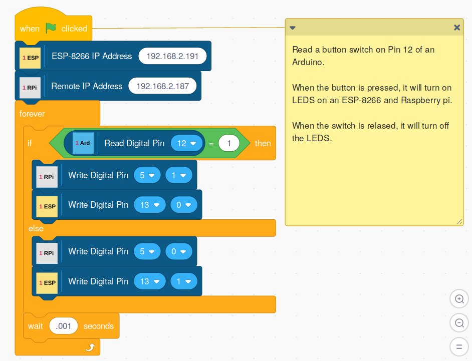

## Controlling Or Monitoring One Board With Another



As the screenshot above shows, it is possible to run multiple OneGPIO
extensions at the same time and have the boards interact with each
other.

This Scratch script will control the LEDs connected to an ESP-8266 and
Raspberry Pi by monitoring the state of a switch on an Arduino.

This script was run in a browser on a PC in offline mode, allowing the
Raspberry Pi to be controlled remotely.

**NOTE: **You may run a single micro-controller or all simultaneously on a single
computer, but only a single instance of a microcontroller may be run at a time.
For example,
you may run a Raspberry Pi and an Arduino simultaneously and use one to control the
other. However, you may not run two of the same type of controller at the same.

Running
two boards that use a serial link is an advanced and experimental feature and not recommended nor
officially supported. An example would be running
an Arduino and a Picoboard on the same computer at the same time.
If you wish to run two boards that use a serial link,
you may have to specify the COM port for one of the boards manually. This is done by using
the -c option in the launcher. For example, to start the Picoboard
extension forcing it to use COM7, you would start the launcher with:

```bash
 s3p -c com7
```

<br> <br> <br>


Copyright (C) 2019-2021 Alan Yorinks All Rights Reserved
