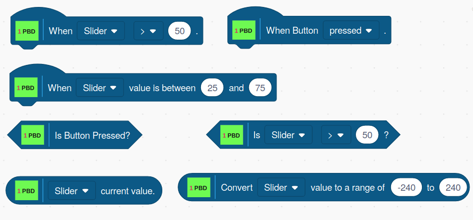

## The Picoboard Blocks

And the blocks translated to Taiwanese

## HAT Blocks

### When The Selected SENSOR Is Less Or Greater Than A Value
This block allows you to select a sensor type, a comparison type, and a
value for the comparison.

For example, ***When Light > 15***.

If the result of the comparison is TRUE, then all of the blocks below
this block are executed once.

### When Button Is Pressed
When the Picoboard button is pressed, all of the blocks below this block
are executed once.

### When The Selected SENSOR Value Is Within A Range
This block uses the current value of the selected sensor to check if its
value is within the specified range. If it is, then all of the blocks
below this block are executed once.

## Boolean Blocks

### Is Button Pressed
When the button is pressed, this blocks returns True. If the button is
not pressed, it returns FALSE.

### Is SENSOR Less Or Greater Than A Value
This block allows you to select a sensor type, a comparison type, and a
value for the comparison. It returns TRUE when the comparison is true
and FALSE when the comparison is false.

## Reporter Blocks

### SENSOR Current Value
This block reports the current value of the selected sensor.

### Convert SENSOR To A Specified Range
This block scales the current value for the selected sensor and to be
within the specified range. So, for example, if the Slider is set to 100
and the range is set to -240 to 240, this block will return 240. If the
Slider is set to 50, this block will return 0, and if the Slider is set
to 0, this block will return -240.

 
      

Copyright (C) 2019 Alan Yorinks All Rights Reserved
