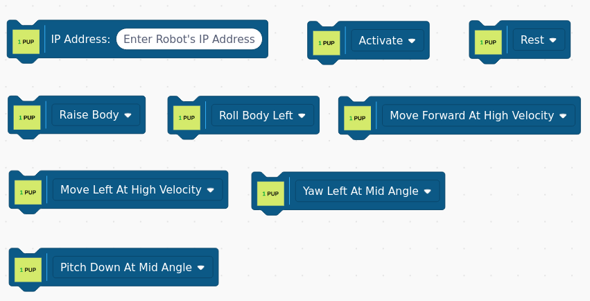
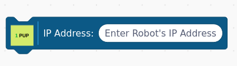
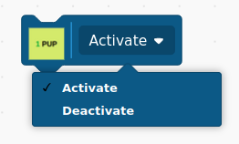
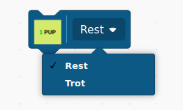
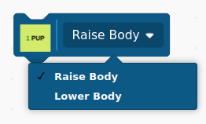
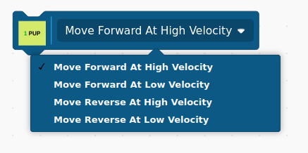
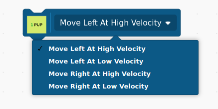
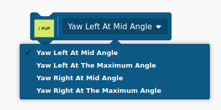
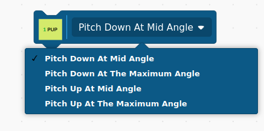

## The Pupper Robot Blocks

### Pupper IP Address
You must specify the Pupper Robot's IP address using this block.

**NOTE**: This must be the first block of your Scratch script. It should only be called
once.

### Activate Block

This block activates or deactivates the robot.

All the remaining blocks control the robot's movement.

