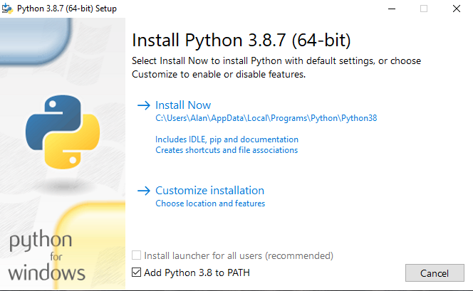

## Python 3.7 Verification
 
The Scratch 3 OneGPIO extension servers utilize the latest advances in
the Python 3.7 asyncio library. Python 3.7 or later is required to run
the servers.

To check if you have Python 3.7 installed open a command window and
type:

```
python3 -V
```

For Windows, you may need to type:

```
python -V
```

The Python version will be displayed:

```
python3
Python 3.7.2 (default, Dec 31 2018, 14:25:33)
[GCC 8.2.0] on linux
Type "help", "copyright", "credits" or "license" for more information.
>>>
```

For Windows users, this may look something like:
```

C:\Users\Alan>python
Python 3.7.2 (tags/v3.7.2:9a3ffc0492, Dec 23 2018, 23:09:28) [MSC v.1916 64 bit (AMD64)] on win32
Type "help", "copyright", "credits" or "license" for more information.
>>>
```

## Installing Python 3.7

### Windows Users

To install Python 3.7 or later, go to the
<a href="https://www.python.org/" target="_blank">Python home page,</a>
and download the latest 3.7 (or later) distribution for your operating system.

If you have Python 2.7 installed, you do not need to remove it.

During the installation process, if there is a checkbox to add Python 3.7 to your path,
 make sure it is checked before proceeding with the installation.



### Mac Users

Go to the
[python.org download page for Mac](https://www.python.org/downloads/mac-osx/)
and download and install the latest version of Python 3.

### Raspberry Pi Users
The 2019-09-26 release of *Raspbian Buster with desktop and recommended
software* comes with Python 3.7 pre-installed. If you are using an older
version of Raspbian, it is easiest to flash the latest version of
Rasbian on to an SD card and start anew.

### Linux Users
If Python 3.7 is not included with your distribution, you may install it
and have it coexist with the supplied version, using the
[*pyenv*](https://realpython.com/intro-to-pyenv/) utility.

<br>
<br>
<br>


Copyright (C) 2019-2020 Alan Yorinks All Rights Reserved


