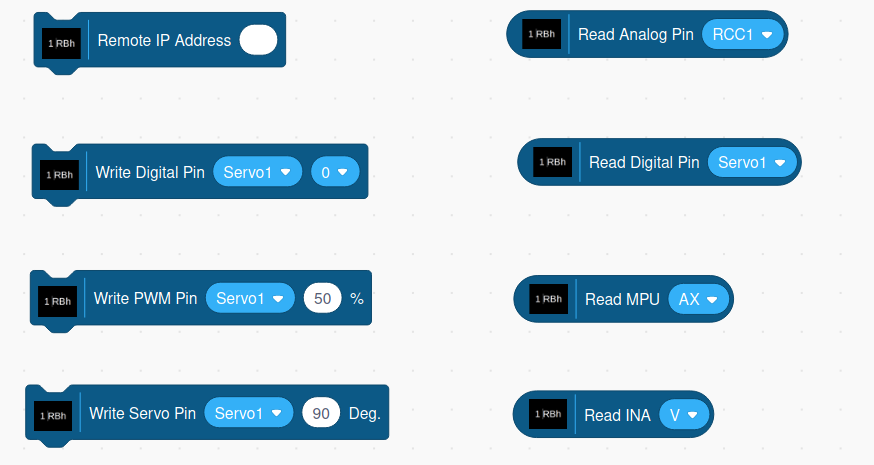

## The RoboHAT MM1 Blocks

The blocks consist of a set of command blocks that are rectangular in
shape and reporter blocks rounded in shape.

### Connecting To A Local Browser Versus A Remote Browser
For the RoboHAT extension, you can run Scratch 3 on a local
browser or a browser on your PC.

For remote operation, in the Remote IP Address block,
you must specify the IP address of the
 computer running s3rh.

NOTE: It is recommended that if you wish to access a RoboHAT using
a remote browser that you install and use the offline version of the
Scratch 3 OneGPIO editor. The reason is, using an online version 
will most likely result in a security error.

### Command Blocks

#### Remote IP Address
If you wish to control the Raspberry Pi from a browser running on your PC, enter the 
Raspberry Pi's IP address into this block. This block
should be executed before any of the other Raspberry Pi blocks and
executed only once.

If you wish to use a local browser running on the Raspberry Pi, do not
use the Remote IP block.

#### Write Digital
This block allows you to select a pin and set its output to either a one
or zero. It has two parameters. The first is a drop-down list of valid
PINs. The second parameter is the output value.
It also is a drop-down list and contains the values zero and one.

#### Write PWM
This block allows you to select a pin and set its PWM output to be a
value between 0 and 100%. It has two parameters. The first is a
drop-down list of valid PINs. The second parameter allows you to fill in
a PWM value. If you use a PWM value of less than zero, it will be set to
0 internally. If you set the value to greater than 100, it will be set
to 100.

#### Write Servo
This block allows you to control the angle of a servo motor. It contains
two parameters. The first is a
drop-down list of valid PINs. The second specifies
the angle in degrees. The value is limited to be between 0 and 180.

### Reporter Blocks

#### Read Digital
This block allows you to read the current state of a digital input pin.
It has one parameter, a drop-down list containing all the valid PINs. It
reports a value of zero or one.

#### Read Analog
This block allows you to read the current state of an analog input pin.
It has one parameter, a drop-down list containing all the valid Pins.
It reports a value between 0 and 1023.

#### Read MPU
This block allows you to read any of the MPU9250 registers selected in the drop-down list:

* AX: Accelerometer X Register
* AY: Accelerometer Y Register
* AZ: Accelerometer Z Register

* GX: GyroScope X Register
* GY: GyroScope Y Register
* GZ: GyroScope Z Register

* MX: Magnetometer X Register
* MY: Magnetometer Y Register
* MZ: Magnetometer Z Register

* Temperature

#### Read INA
This block allows you to read any of the INA219 registers selected in the drop-down list:

* V: Bus Voltage
* A: Bus Current
* Supply: Supply Voltage
* Shunt: Shunt Voltage
* Power: Power
* Power: Power

