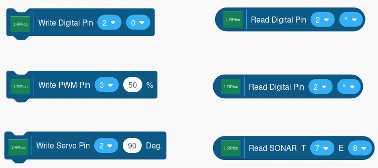

## The Raspberry Pi Pico Blocks

The blocks consist of a set of command blocks that are rectangular in
shape and reporter blocks rounded in shape.

### Command Blocks

#### Write Digital
This block allows you to select a pin and set its output to either a one
or zero. It has two parameters. The first is a drop-down list of valid
PINs. The second parameter is the output value.
It also is a drop-down list and contains the values zero and one.

**NOTE:** Pin 25 controls the board LED.

#### Write PWM
This block allows you to select a pin and set its PWM output to be a
value between 0 and 100%. It has two parameters. The first is a
drop-down list of valid PINs. The second parameter allows you to fill in
a PWM value. If you use a PWM value of less than zero, it will be set to
0 internally. If you set the value to greater than 100, it will be set
to 100.

**NOTE:** Pin 25 controls the board LED.

#### Write Servo
This block allows you to control the angle of a servo motor. It contains
two parameters. The first is a
drop-down list of valid PINs. The second specifies
the angle in degrees. The value is limited to be between 0 and 180.

### Reporter Blocks

#### Read Digital
This block allows you to read the current state of a digital input pin.
It has two parameters, a drop-down list containing all the valid GPIO pins
and a parameter
to enable or disable the pull-up resistor on the Pico GPIO pin. It
reports the raw value of zero or one.

#### Read Analog
This block allows you to read the current state of an analog input pin identified
by its ADC number.

| ADC Number |   GPIO Pin Number  |
|:----------:|:------------------:|
|      0     |         26         |
|      1     |         27         |
|      2     |         28         |
|      3     | Temperature Sensor |

It has one parameter, a drop-down list containing all the ADC Pins.
It reports a value between 0 and 4095. 

#### Read Sonar
This block allows you to connect an HC-SR04 type device. It has two
parameters, both containing a drop-down list of valid PINs. The
first parameter allows you to select a trigger pin, and the second an
echo pin. It returns the measured distance in centimeters.
 
 
      

Copyright (C) 2019-2021 Alan Yorinks All Rights Reserved
