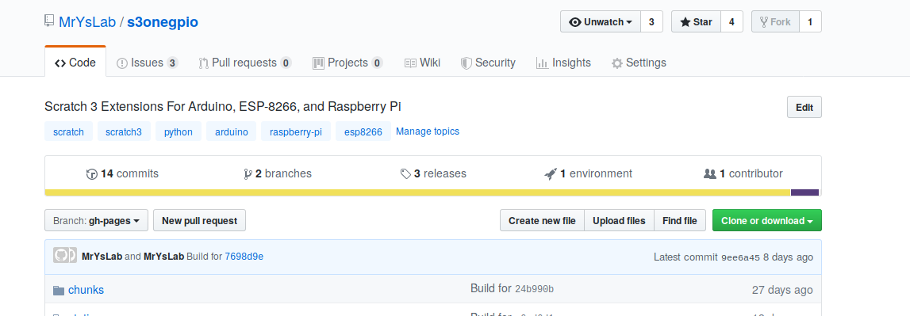
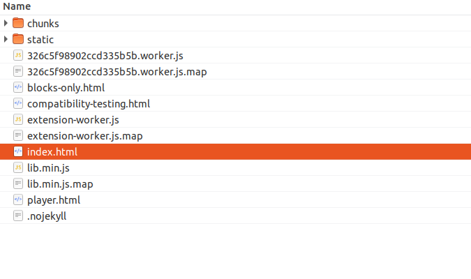
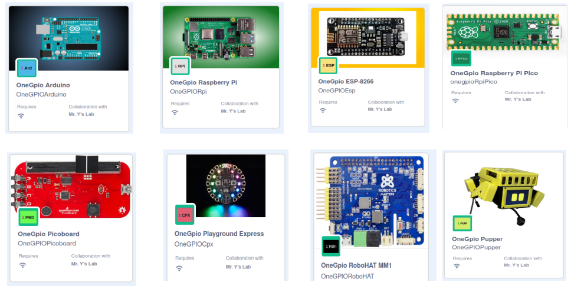

## Launching Scratch 3 Offline
First, you need to download the files. Go to the [s3onegpio GitHub 
Repository, gh-pages branch.](https://github.com/MrYsLab/s3onegpio/tree/gh-pages)

Click on the green Clone or download button at the upper right. 

Save the
file and then unzip it. This will create a directory called
*s3onegpio-gh-pages*. 

Using your file explorer tool, look for *index.html* in the
s3onegpio-gh-pages directory and double click on index.html. The Scratch
3 OneGPIO editor should open.

 
 To
 access the OneGPIO extensions, click on the Extension Icon at the lower
 left of the Scratch 3 Editor Window. 

 

Scroll down and select the OneGPIO extension you wish to use. You may then choose additional OneGPIO extensions.
Go to the "Using OneGPIO Extension Blocks" section for information on block usage.

 
 
 

Copyright (C) 2019 Alan Yorinks All Rights Reserved
