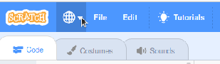
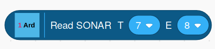
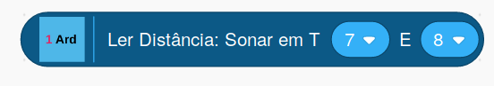

## Block Text And Alert Translations

When you select a language by clicking on the *globe* icon in the
Scratch editor, if a translation is available for the selected language,
the OneGPIO Scratch block text appears in that language.



If translation for your selected language is not available, then the
text will be in English.

If your language is not currently supported and you wish to provide a
translation, I encourage you to do so. Not only will you be listed as a
contributor, but others who are speakers of your language will thank you
as well.

### Providing A Translation

To provide a translation for the Arduino, ESP-8266, and Raspberry Pi
extensions, you simply update the
[translate.txt file.](https://github.com/MrYsLab/s3onegpio/blob/master/translations/translations.txt)
For the Picoboard, you update the
[picoboard.txt file](https://github.com/MrYsLab/s3onegpio/blob/master/translations/picoboard.txt).
And for the CircuitPlayground Express, you update the
[playground_express.txt file.](https://github.com/MrYsLab/s3onegpio/blob/master/translations/playground_express.tx)
You then either generate a GitHub pull request or if you are unfamiliar
with Git and pull requests, submit it as an issue to
[https://github.com/MrYsLab/s3onegpio/issues.](https://github.com/MrYsLab/s3onegpio/issues)
If you submit the translation as an issue, please call the issue:

Translation For ***LANGUAGE BEING ADDED***, 

where ***LANGUAGE BEING ADDED*** is the name of your language.

I will then incorporate your translation into the source code and update
the Scratch 3 Editor to contain your translation.

### Translations.txt, Picoboard.txt, And Playground_Express.txt
 
 The translations.txt, picoboard.txt, and playground_express.txt files contain the text for all
 of the blocks and alerts for the OneGPIO extensions.

Let's look at the Sonar block to understand what needs to be added to
the translations.txt file.
 
 Here we see the English and Brazilian Portuguese blocks for the Sonar
 block.






Here is the language specification for the block in translation.txt.

```
const FormSonarRead = {
    'pt-br': 'Ler Distância: Sonar em T[TRIGGER_PIN] E[ECHO_PIN]',
    'pt': 'Ler Distância: Sonar em T[TRIGGER_PIN] E[ECHO_PIN]',
    'en': 'Read SONAR  T [TRIGGER_PIN]  E [ECHO_PIN]'
};
```

Each language has its own line in the list of translations, and each
line begins with the language's identifier. In this case, **pt-br** for
Brazilian Portuguese, **pt** for Portuguese, and **en** for English.

Any text between square brackets is a placeholder for a parameter field
in the block. Do not translate the text within the square brackets, and
please use them as is, no matter the alphabet being used. All other text
should be translated.

You are free to use as many words as you need.  The parameters (text 
in square brackets) may be placed anywhere within the translation 
that makes sense for your language.

### Alert Translation

Alerts do not contain any parameters.

The alert for the ESP-8266 is formatted a little differently. 

```
// ESP-8266 Alert
const FormAlrt = {
    'pt-br': {
        title: "Atenção",
        text: "Informe o endereço IP da placa ESP-8266 no bloco apropriado",
        icon: "info",
    },
    'pt': {
        title: "Atenção",
        text: "Informe o endereço IP da placa ESP-8266 no bloco apropriado",
        icon: "info",
    },
    'en': {
        title: "Reminder",
        text: "Enter the IP Address of the ESP-8266 Into The IP Address Block",
        icon: "info",
    }
};
```

For this translation, translate the text in the "title" and "text"
fields, but do not translate the "icon" field. Please retain the words
title, text, and icon in English.

If you have any questions, please feel free to email me at:
[MisterYsLab@gmail.com](mailto:MisterYsLab@gmail.com)


<br>
<br>
<br>


Copyright (C) 2019-2022 Alan Yorinks All Rights Reserved
