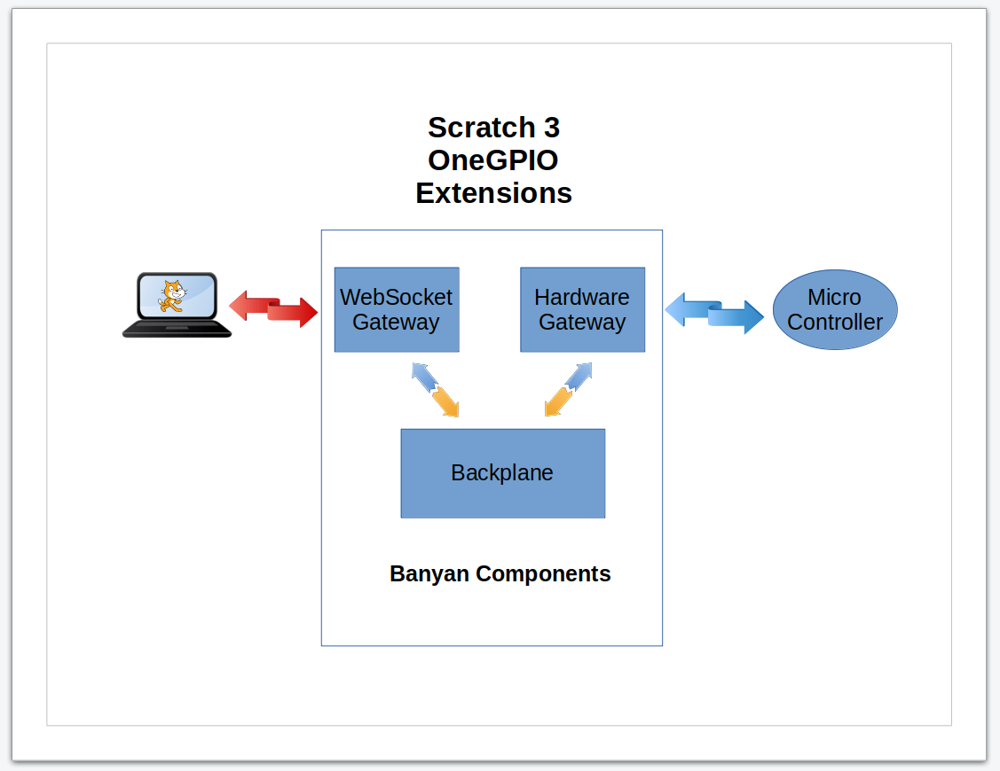

## Scratch 3 OneGPIO Software Components

The Scratch 3 OneGPIO extensions consist of two major components. 

### The Modified Scratch 3 Editor

The first of the major components is the
[modified Scratch 3 editor, ](https://github.com/MrYsLab/s3onegpio) depicted as the terminal 
on the left side of the illustration above. The modified editor uses all of the Scratch 3 team's code but adds the 
additional code to create the custom Scratch blocks to support the OneGPIO extensions.

If you would like additional information about how the OneGPIO
extensions were created and added to the Scratch 3 editor, please refer
to the
[Bots In Pieces blog.](https://mryslab.github.io/bots-in-pieces/scratch3/gpio/2019/09/15/scratch3-1.html)

### The OneGPIO Extension Servers 
 
 The second major component for each of the OneGPIO extensions is the
 Extension Server, depicted in the center of the illustration.
 
 Each board type has a specific associated Extension Server, using the
 [Python Banyan Framework](https://mryslab.github.io/python_banyan/#users_guide/#_top) to implement
 the 
 [OneGPIO messaging protocol.](https://mryslab.github.io/python_banyan/#gpio_intro/)
 
 The OneGPIO design concept assures excellent performance and simplifies the 
 design and implementation for each extension server.
 
 Each server utilizes three Python Banyan components. The first is the
 [Backplane, ](https://mryslab.github.io/python_banyan/#examples_intro/#the-banyan-backplane)
 a shared message distributor used by all of the extension servers. 
 
 Each
 Extension Server utilizes a unique instance of the
 [WebSocket Gateway](https://mryslab.github.io/python_banyan/#additional_gateways/#websocket-gateway).
 It provides a communication channel between the Scratch 3 editor running in the browser
 and the Python code interacting
  with microcontroller hardware. A
 unique IP port number is assigned to each WebSocket Gateway.
 
 Finally, each Extension Server supports its connected microcontroller using a unique
 [Hardware Gateway.](https://mryslab.github.io/python_banyan/#banyan_gateways/#introduction-to-onegpio-gateways)
 The Hardware Gateway translates the platform-independent OneGPIO control and report
 messages to hardware-specific messages.
 
 The transport mechanism used between the Hardware Gateway and its
 associated micro-controller varies, depending upon the micro-controller
 in use. For example, the Arduino uses a hardwired, USB-Serial interface
 is used. The Raspberry Pi, ESP-32, and ESP-8266 use a WiFi connection.

